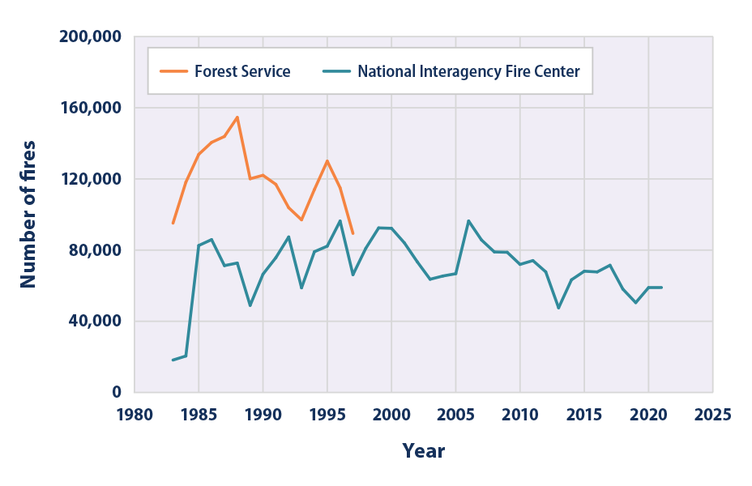
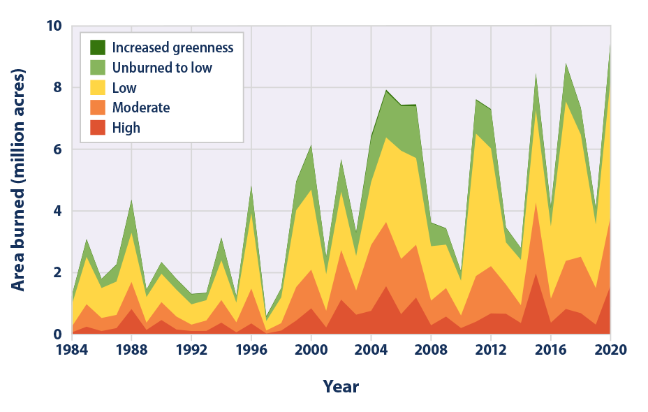

# FireOrNot
### Author: Irwin Lam

### Overview  
Forest, shrubland, and grasslands are important resources, both environmentally and economically. Although wildfires are natural and vital for the health of these ecosystems. Multiple studies have found that climate change has already led to an increase in wildfire season length, wildfire frequency, and burned area. Some important factors are warmer springs, longer summer dry seasons, and the severity of fires through incresaed temperatures and drought. With warmer weathers, melting and reduced snowcaps result in a decreased water availablity during hot summer conditions. This results in the fires to start more easily and burn hotter due to the lack of moisture. Wildfires are deadly once they start to grow. Combatting these wildfires are incredibly dangerous to the firefighters and whoever else. Just in the United States alone, every year more than $1 billion is used to fight wildfires. In 2020, United States spent $2.3 billion dollars. The fires themselves also cause havoc to the surrounding area as well with the smoke they produced. Wildfire is linked with poor air quality that can lead to significant health effects. 

Since 1983, the National Interagency Fire Center (NFIC) has documented an average of approximately 70,000 wildfires per year in the United States alone. The extent of the damage from wildfires appeared to have increased since the 1980s. According to NIFC, the largest acreage burned within a ten year span occurred during the 2004-2015 time where 2015 was the peak. This time frame coincides with the many of the warmest years on record nationwide. The largest increases of wildfire damage have occurred during the spring and summer months which are the warmest time of the year. 

The frequency of the wildfires in the past 40 years. 

The damage of the wildfire. 

With this information, it would be important to create a model that can detect the early stages of wildfires to prevent them from growing too large. This would prevent the lives from being lost and money from being spent. 

### Dataset
The data can be found [here](https://www.kaggle.com/datasets/abdelghaniaaba/wildfire-prediction-dataset/data). 

### Model Results
After preprocessing the data and testing for over 20 models using various Conv2d, MaxPooling, Dropout, Batchnormalization, learning rate and image augmentation, the final results was an 98.6% accuracy rate on validation, 98.96% on testing, and 98.96% on training. 

### Website
I created a simple website in streamlit to showcase my model where a user can submit an satellite image that the model will use to predict if it has a wildfire or not. I added a feature where you change the number of images display and see if you can do better than the model. You look at it [here](https://irwin-lam-fireornot-streamlit-app-pgkq6i.streamlit.app/)

### Repo structure
├── README.md  
├── Figures  
│   ├── nowildfire (Images)  
│   ├── wildfire (Images)  
│   ├── wildfire_dmg.png  
│   ├── wildfire_freq.png  
│   ├── movie_risk_genre.csv  
│   └── persons.csv  
├── Logs  
│   ├── 224x224  
│   ├── 64x64       
│   ├── 32x32    
├── Models_weights  
│   ├── CNN4_best     
├── src
│   ├── movie_data_erd.jpeg│     
│   ├── risk_level_graphs│     
│        ├── level_1.png  
│        ├── level_2.png  
│        ├── level_3.png  
├── Final_Model.ipynb  
├── Notebooks  
│   ├── CNN_models.ipynb  
│   ├── Model_1.ipynb  
│   ├── Tuning_CNN1.ipynb  
│   ├── Tuning_CNN4.ipynb  
├── src  
│   ├── __init__.py  
│   ├── build_models.py  
│   ├── extract_to_df.py  
│   ├── metric_notes.py  
│   ├── visualizations.py  
├── streamlit_app.py  
├── requirements.txt  
